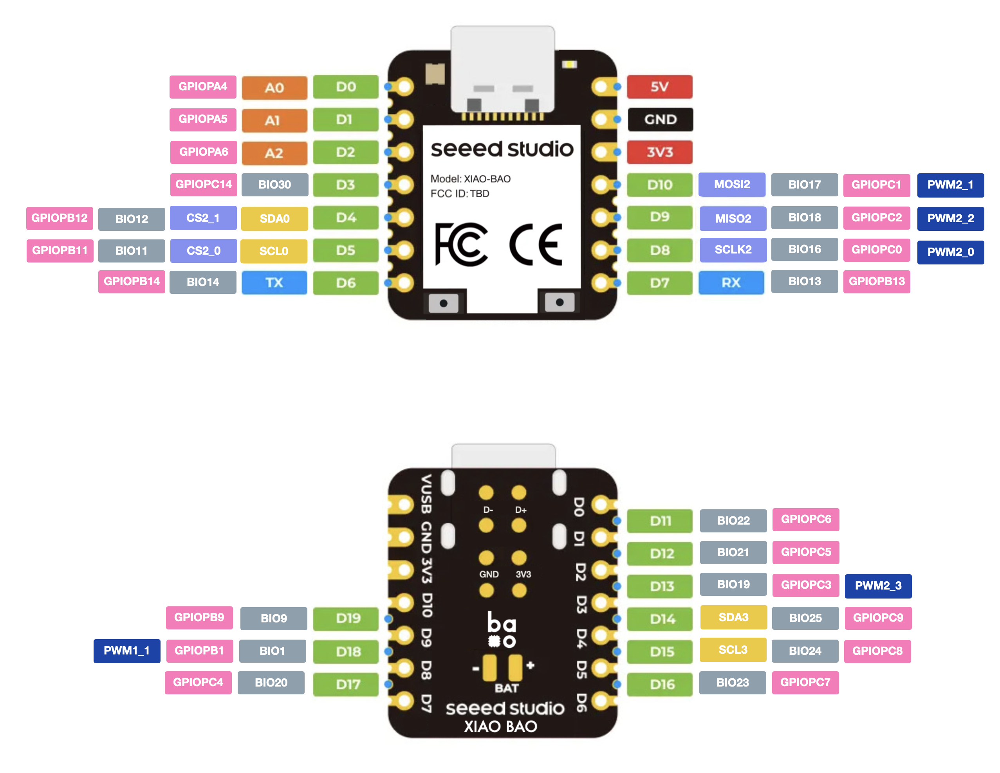

# Xiaobao

Xiaobao (小包) is a miniaturized evaluation board for the [Baochip-1x](https://github.com/baochip/baochip-1x), forked from the original [Dabao](https://github.com/baochip/dabao) design. This board was initially developed during the MIT Residency at Seeed in January 2026.

The board uses the [Seeed Studio XIAO](https://wiki.seeedstudio.com/SeeedStudio_XIAO_Series/) form factor, making it compatible with the XIAO ecosystem of carrier boards and accessories.

## About the Baochip-1x

The Baochip-1x is a mostly open-RTL, RISC-V microcontroller fabricated in TSMC 22nm:

| Feature | Specification |
|---------|---------------|
| CPU | Vexriscv RV32-IMAC @ 350 MHz |
| RAM | 2 MB integrated SRAM |
| Storage | 4 MB RRAM (non-volatile, similar to flash) |
| IO Accelerator | Quad-core PicoRV32 @ 700 MHz |
| USB | USB 2.0 High Speed with integrated PHY |

## Pinout

 This table provides the mapping between the digital labels on the XIAO module and the internal baochip1x peripheral functions.

 

| Label | Pin ID | Name | AF1 | AF2 | AF3 | ANA/Power | BIO |
| :--- | :--- | :--- | :--- | :--- | :--- | :--- | :--- |
| **D0** | G3 | PA4 | UARTTX_0 | - | - | ADC0 | - |
| **D1** | C4 | PA5 | - | - | I2CSCL_0 | ADC1 | - |
| **D2** | F6 | PA6 | - | - | I2CSDA_0 | ADC2 | - |
| **D3** | D2 | PC14 | - | - | - | - | 30 |
| **D4** | C9 | PB12 | I2CSDA_0 | - | - | - | 12 |
| **D5** | B9 | PB11 | I2CSCL_0 | - | - | - | 11 |
| **D6** | E9 | PB14 | UARTTX_2 | - | - | - | 14 |
| **D7** | D9 | PB13 | UARTRX_2 | - | - | - | 13 |
| **D8** | F9 | PC0 | - | SPMCLK_2 | PWM_2[0] | - | 16 |
| **D9** | H9 | PC2 | - | SPMD1_2 | PWM_2[2] | - | 18 |
| **D10** | G9 | PC1 | - | SPMD0_2 | PWM_2[1] | - | 17 |
| **3V3** | A3/H4 | +3.3V | - | - | - | Power Rail | - |
| **GND** | F5/D4 | GND | - | - | - | Ground | - |
| **5V** | - | VBUS | - | - | - | Power Input | - |
| **D11** | F4 | PC6 | - | I2CSDA_3 | - | - | 22 |
| **D12** | E3 | PC5 | - | I2CSCL_3 | - | - | 21 |
| **D13** | H8 | PC3 | - | SPMCS0_2 | PWM_2[3] | - | 19 |
| **D14** | H3 | PC9 | - | - | - | - | 25 |
| **D15** | H6 | PC8 | - | - | - | - | 24 |
| **D16** | H7 | PC7 | - | - | - | - | 23 |
| **D19** | C8 | PB9 | - | - | - | - | 9 |
| **D18** | A9 | PB1 | - | - | PWM_1[1] | - | 1 |
| **D17** | E8 | PC4 | - | SPMCS1_2 | - | - | 20 |

## Design Files

This repo contains KiCad 8 design files:

- `xiaobao.kicad_sch` — Schematic
- `xiaobao.kicad_pcb` — PCB layout
- `xiaobao.pdf` — Schematic PDF export
- `jlcpcb/` — Production files for JLCPCB fabrication
- `production/` — Additional manufacturing outputs
- `xiao.pretty/` — Custom footprint library

## Resources

- [baochip.com](https://baochip.com/) — Official site with links to documentation, OS, and purchasing info
- [Coder's Guide to the Baochip-1x](https://baochip.github.io/baochip-1x/) — Hardware reference and peripheral docs
- [Dabao on Crowd Supply](https://www.crowdsupply.com/baochip/dabao) — Original eval board campaign
- [Seeed Studio XIAO Series](https://wiki.seeedstudio.com/SeeedStudio_XIAO_Series/) — Compatible form factor ecosystem
- [Seeed Maker Camp](https://github.com/Seeed-Studio/MakerCamp/tree/main/2026-01-MIT/Sam) — Project documentation from Maker Camp Shenzhen

## License

This project is licensed under the [CERN Open Hardware License Version 2 - Weakly Reciprocal (CERN-OHL-W-2.0)](LICENSE).

You can use, modify, and distribute the design (including commercially), but if you distribute modified hardware or design files, you must release those modifications under the same license.

## Acknowledgments

Based on the [Dabao](https://github.com/baochip/dabao) evaluation board by [Baochip](https://github.com/baochip).

### Xiaobao vs Dabao

Xiaobao is a smaller form factor variant of the Dabao eval board. Key differences:

- 6-layer PCB for higher routing density
- More GPIO broken out despite smaller size
- Onboard battery charging (LiPo)